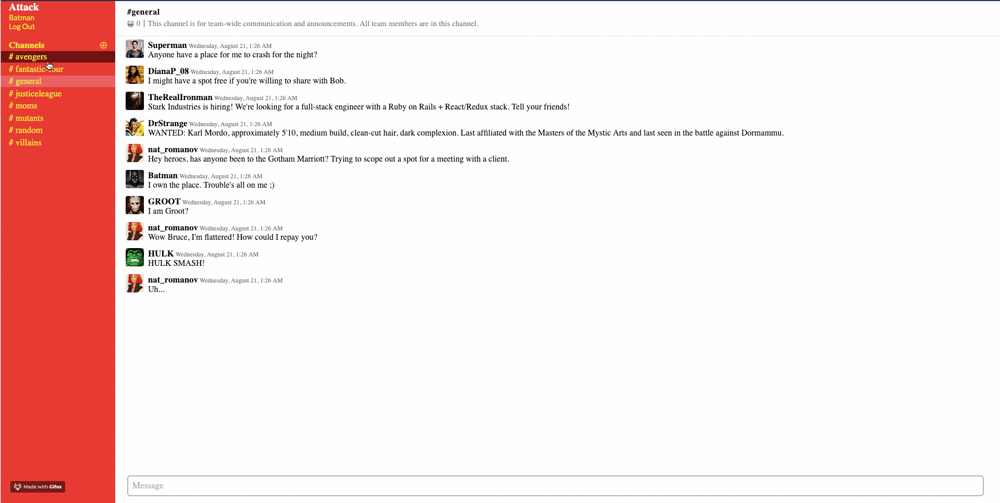

# Attack
<kbd></kbd>

[Attack](https://attackslack.herokuapp.com) is a superhero-themed, instant-messaging application inspired by [Slack](https://slack.com). The application was built over a week, but over time, newer features and bux fixes will be pushed out.


## Technologies
- Ruby on Rails

    _Convention over configuraton_. Rails allows you to set up a web application very quickly without the need to write boilerplate that would make meeting the 10-day timeline for this application unfeasible, and so was my framework of choice.

- JavaScript (Node.js)

  The language of the internet.

- Action Cable

  The cornerstone technology for this project, Action Cable is a Rails library that is the engine behind the instant-messaging functionality featured in Attack.
  
- React-Redux

  Name a better duo! React was chosen for its performant rendering of UI components via its fancy _reconciliation_ processes and diffing algorithms. Redux is my frontend state management library of choice, given its ideas of read-only state, and pure function state reducers, allowing for easier debugging.

- HTML5

  No external use of any APIs other than the Window interface - setting a few photos on the window to allow for quick and dirty rendering of photos.
- CSS (Sass)

  (_nearly_) Vanilla CSS was used to do all the styling visible in the application. In endeavoring to faithfully mirror Slack's user interface, using basic CSS allowed for maximum customizability, especially given that a lot of Slack's styling is buried under a lot of arcane stylesheets. Sass was used a preprocessor to allow for nesting of selectors, and as a consequence, DRYer code.
- PostgreSQL
  
  A good SQL database choice for scalable applications.

- Babel

  Allowed for transpilation of JS6 and JSX into older versions of JavaScript.

- Webpack

  My module bundler of choice. Was more of a CoC decision.


## Installation
In Terminal, navigate to the root directory of the project, and run the following

1. `bundle install` (requires bundler)
2. `npm install` (requires npm)
3. `npm run start` (has Webpack watch for any changes to the code)
4. In a separate tab, `rails server`
5. Navigate to your browser and go to `localhost:3000`
6. Any changes made to the project will be logged by npm. To view any potential changes in your browser view, refresh the page.

## Live Chat
Attack's main feature of live messaging uses *WebSocket*s. Like HTTP, WebSocket is a communication protocol that uses what is known as _full-duplex_ communication.



 Whereas in HTTP request/response cycles, one machine must act as a sender and another as a receiver in disparate cycles, WebSockets allows for persistent connections between clients and servers, and allows for both entities to transmit and receive information simultaneously.

The means by which we achieve full-duplex communications is via Rails's Action Cable library. When any user goes to the main application view, a _subscription_ to an Action Cable _channel_ is created. 

```javascript
  App[channelId] = App.cable.subscriptions.create(
    {channel: "ChannelChannel", id: channelId},
    {received: function(data) {
        const message = JSON.parse(data.message)
        dispatch(receiveMessage(message));
      },
      speak: function(message) {
        return this.perform('speak', {message});
      }
    });
  ```
  When a user submits a message through a React component, the `speak` callback is invoked, and the message gets passed to the Rails backend. In Rails land, we have:

  ```ruby
  def speak(data)
    incoming_message = (data["message"])
    created_message = Message.create(incoming_message)
  end
  ```
  In the creation of the indiviudal message resource, what is known as an _job_, which is essentially an operation, is performed (Rails's `ActiveJob` module), and the message gets broadcasted back to all the _subscribers_ of the original Action Cable channel.

  ```ruby
  def perform(message)
    ActionCable.
    server.
    broadcast(
      'channel_channel', message: render_messag(message)
    )
  end
  ```

## Future features
A non-exhaustive list of features to add to the application:

- [ ] Ability to nest multiple contiguous messages from a user under one "block"
- [ ] Hyperlinks to user's profile on messages
- [ ] Dark Mode (aka Batman mode)
- [ ] Allowing for multiple ActionCable subscriptions
- [ ] Custom URL
- [ ] AWS hosting of profile photos
- [ ] DMs, workspaces, and channel creation
